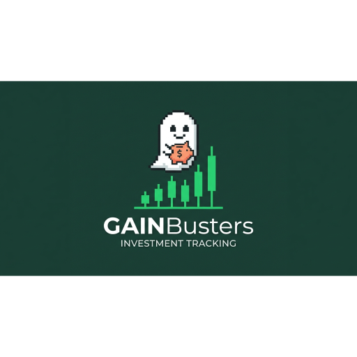

<div align="center">
  
  <h1>GainBusters</h1>
  <p><strong>Private, Self-hosted Portfolio Manager & Multi-Currency Asset Tracker</strong></p>

  [](./LICENSE)
  [](./Dockerfile)
  [](https://www.typescriptlang.org/)
  []()
</div>

---

## 🌟 Overview

**GainBusters** is a powerful, modern, self-hosted financial portfolio manager designed for privacy-conscious investors who want complete control over their financial data. Whether you track global equities, ETFs, cryptocurrencies, bonds, savings accounts, or real estate assets, GainBusters provides enterprise-grade analytics without ever sending your sensitive net worth details to third-party servers.

### ✨ Key Features
- 📊 **Unified Asset Tracking**: Manage multi-asset portfolios across diverse brokers and bank accounts.
- 💱 **Multi-Currency & Real-time Quotes**: Live rate conversion and market data integration via public APIs (e.g., Yahoo Finance).
- 📈 **Advanced Analytics**: Interactive allocation breakdown, historical net worth charts, benchmark comparisons, and dividend projections.
- ⚖️ **Smart Rebalancing Engine**: Set target allocations and let GainBusters calculate exact buy/sell orders to maintain your risk profile.
- 🔒 **Zero Telemetry & 100% Privacy**: No user tracking, no hidden external databases, and full password protection.

---

## 💾 Storage Architecture (`STORAGE_MODE`)

GainBusters is architected with a flexible dual-storage persistence engine to fit any deployment scenario:

### 1. `browser` Mode (Local File Encryption / Client-Only)
- **How it works**: When deployed statically or accessed client-side, GainBusters uses the browser File System Access API. You create or select a database file directly on your own physical device (computer/phone/tablet), and the app writes your portfolio state, transactions, and preferences directly to this local file.
- **Cryptographic Engine**: Your local database file is protected with military-grade **AES-GCM-256** encryption using **PBKDF2** key derivation. All cryptographic operations occur locally within your browser memory—no plaintext data, keys, or passwords ever leave your device.
- **Best for**: Static hosting (such as Vercel, Netlify, or GitHub Pages), zero-trust SaaS usage, or investors who want total physical custody of their financial database file.
- **⚠️ CRITICAL SECURITY NOTE**: Because GainBusters operates on a strict zero-knowledge architecture without external database backends, **there is no password recovery mechanism. If you forget or lose your master password, your encrypted database files cannot be decrypted, and your portfolio data will be permanently lost.**

### 2. `local` Mode (Server Filesystem / Docker Persistence)
- **How it works**: Portfolio state is written to persistent JSON files stored inside the container or server filesystem (in the `./data` directory).
- **Best for**: Self-hosted Docker environments, multi-device syncing across your home network, or private home servers (NAS, Raspberry Pi).
- **Security**: Password-protected master access ensures your data remains encrypted and safe at rest.

---

## 🐳 Self-Hosting Guide (Docker)

GainBusters is packaged for effortless container deployment.

### 🪟 Beginner Guide: Windows 11 with Docker Desktop
If you are new to self-hosting and want to run GainBusters locally on your Windows PC:

1. **Install WSL 2 & Docker Desktop**:
   - Download and install [Docker Desktop for Windows](https://www.docker.com/products/docker-desktop/).
   - During setup, ensure **WSL 2 (Windows Subsystem for Linux)** integration is enabled.
   - Start Docker Desktop and wait until the status indicator in the bottom left turns **Green (Running)**.

2. **Clone or Download the Repository**:
   - Download this project as a ZIP archive and extract it to a folder (e.g., `C:\GainBusters`), or clone via Git:
     ```powershell
     git clone https://github.com/yourusername/gainbusters.git
     cd gainbusters
     ```

3. **Launch with Docker Compose**:
   - Open PowerShell or Command Prompt inside the `GainBusters` folder and run:
     ```powershell
     docker compose up -d --build
     ```
   - Open your web browser and navigate to: `http://localhost:3000`

---

### 🛠️ Manual Docker Build & Export Flow

For offline transfers, air-gapped home servers, or custom container builds, follow these exact production steps:

```bash
# 1. Synchronize package lockfile (Required before Docker build if dependencies changed)
npm install --package-lock-only

# 2. Build the production container image
docker build -t gainbusters:latest .

# 3. Optional: Save container image as a standalone tar archive for transfer
docker save -o gainbusters.tar gainbusters:latest

# To load the tar archive on another server:
# docker load -i gainbusters.tar
```

---

## 💻 Local Development & Compilation

To modify code or run GainBusters directly on Node.js without Docker:

### Prerequisites
- **Node.js** v18.0 or higher
- **npm** v9.0 or higher

### Step-by-Step Setup
```bash
# 1. Clone the repository
git clone https://github.com/yourusername/gainbusters.git
cd gainbusters

# 2. Install project dependencies
npm install

# 3. Start the local development server (binds to http://localhost:3000)
npm run dev

# 4. Compile and bundle for production deployment
npm run build

# 5. Run the production server locally
npm run start
```

---

## ⚖️ Disclaimer & Legal Notice

> **IMPORTANT LEGAL & FINANCIAL ADVISORY**
>
> **This software is exclusively an automanaged tracking and monitoring tool. The analytics, reports, tables, calculations, and graphs generated are for educational, illustrative, and informational purposes only and must never be interpreted, relied upon, or construed as professional financial, investment, legal, or tax advice, nor as a solicitation or recommendation to buy or sell securities. No reports, calculations, or values are guaranteed to be accurate, timely, complete, or free of errors.**
>
> **Under the maximum extent permitted by US, UK, Italian, and international laws, the developer and any contributors shall have absolutely no liability whatsoever for any direct, indirect, incidental, special, punitive, exemplary, or consequential damages, financial losses, or costs arising from your use of, or inability to use, this software, or your reliance on any metrics displayed. The system processes market quotes fetched from third-party APIs (such as Yahoo Finance) and manual user inputs, which may display incorrect, delayed, or corrupt values. For any real-world investment decisions, you must rely solely on official statements from your authorized brokers, banks, or registered financial advisors.**

---

## 📜 License & Copyright

- **License**: Distributed under the restrictive **GNU Affero General Public License v3.0 (AGPLv3)**. See [`LICENSE`](./LICENSE) for details.
  - *Note on SaaS & Commercial Use*: The AGPLv3 license requires anyone hosting or modifying this software over a network to make their complete source code publicly available under AGPLv3. Commercial SaaS licensing or proprietary distribution exceptions require prior authorization from the copyright holder.
- **Copyright**: &copy; 2026 **Francesco Garzia** (`https://www.garzia.it/`). All rights reserved.
- **Trademarks**: The name **GainBusters**, associated logos, and branding elements are proprietary trademarks. See [`TRADEMARKS.md`](./TRADEMARKS.md).
- **Contributing & CLA**: Contributions are welcome! All contributors must agree to the Contributor License Agreement. See [`CONTRIBUTING.md`](./CONTRIBUTING.md) and [`CLA.md`](./CLA.md).
